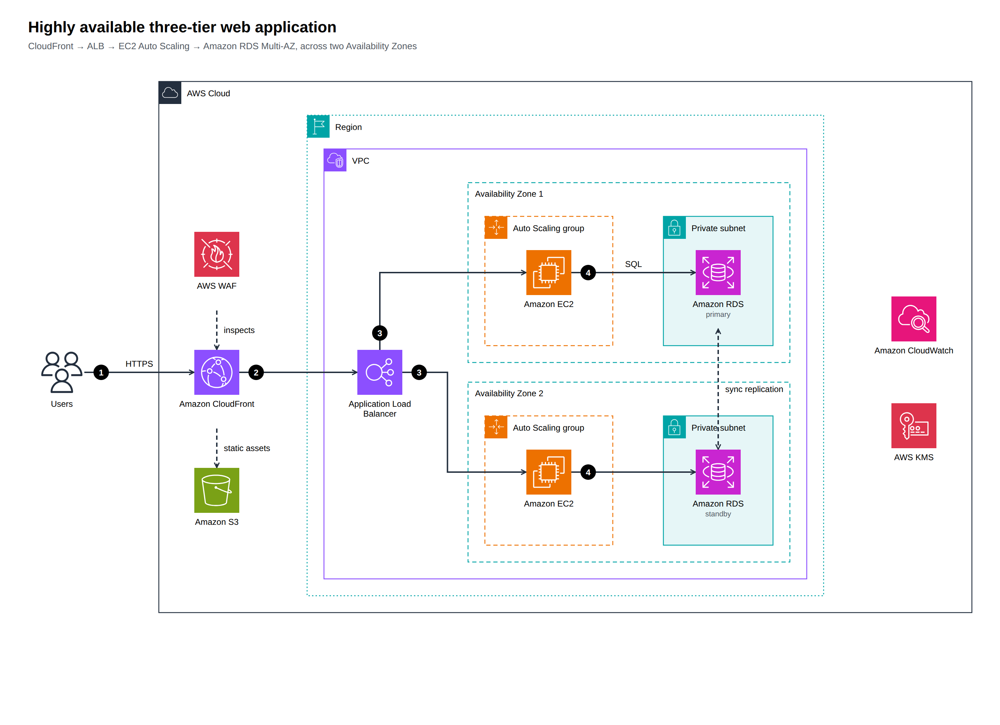
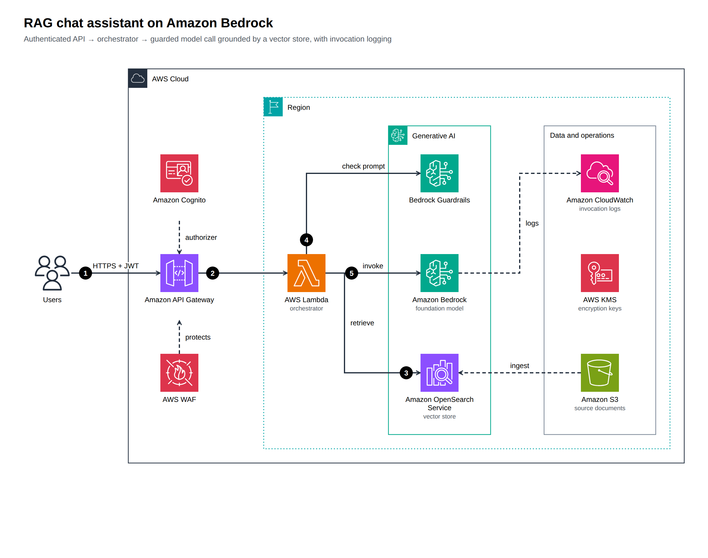

# archify-aws

Generate **AWS architecture diagrams** from a typed JSON spec — using the **official AWS Architecture Icons**, the
deck's group/arrow/label conventions, and an advisory **AWS Well-Architected** (six pillars) and **Generative AI Lens**
review. A companion to [tt-a1i/archify](https://github.com/tt-a1i/archify): describe the system, get a standalone,
explorable HTML (plus SVG/PNG) and a receipt of what was checked.

| Three-tier on two AZs | RAG assistant on Bedrock |
|---|---|
|  |  |

## Quick start
```bash
git clone https://github.com/akashtalole/archify-aws && cd archify-aws
npm run icons:fetch                                  # official icon package → assets/aws-icons/ (git-ignored)
node bin/archify-aws.mjs render examples/genai-rag.json --png
open examples/out/genai-rag.html
```
Node ≥ 20, **no npm dependencies**. PNG export needs Chrome/Chromium (`CHROME_PATH` or a Playwright browser).

### Use it from an AI agent
`SKILL.md` is an agent skill (same shape as Archify's). Point your agent at this repo and say, e.g.:
*"Use archify-aws to diagram a multi-AZ web app on ECS Fargate with Aurora, and review it against the Well-Architected pillars."*
The agent searches icons, authors the spec, renders with `--strict --json`, repairs warnings, looks at the PNG, and reports.

## What you get
* **Official look** — service icons unmodified at 64px; group styles for AWS Cloud, Region, AZ, VPC, public/private
  subnet, security group, Auto Scaling, account, corporate data center, custom service groups; 12px Arial labels
  (≤ 2 lines); open-arrow orthogonal connectors; black numbered callouts; light and dark themes.
* **Layout + routing** — nest groups, list children; rows align icon centre lines; the router avoids nodes and group
  headers, prefers straight lines, and warns (exit code 2 with `--strict`) when it can't find a clean route.
* **Interactive HTML** — hover a node/step/finding to focus its connections, light/dark toggle, SVG download, flow list.
* **Well-Architected review** — ~25 heuristics across the six pillars plus Generative AI Lens rules (guardrails,
  invocation logging, API boundary, PrivateLink, retrieval, resilience, cost, agent permissions). Advisory: it reads the
  *drawing*, not your configuration.
* **Icon catalog** — 305 service, 419 resource, 47 general and 15 group icons (SVG); `icons search`, aliases (`alb`, `s3`, `kms`…).

## Commands
```text
archify-aws render <spec.json> [-o out.html] [--svg] [--png] [--theme dark] [--no-review] [--strict] [--json]
archify-aws validate <spec.json>          archify-aws review <spec.json>
archify-aws icons search|info|categories|groups
archify-aws init three-tier|serverless-api|genai-rag      archify-aws fetch-icons | doctor
```
Spec format: [references/spec.md](references/spec.md) · AWS conventions: [references/aws-diagram-guidelines.md](references/aws-diagram-guidelines.md) ·
review rules: [references/well-architected.md](references/well-architected.md).

```json
{ "meta": { "title": "Hello AWS" },
  "root": { "layout": "row", "children": [
    { "id": "u", "icon": "users", "label": "Users" },
    { "id": "cloud", "kind": "aws-cloud", "children": [
      { "id": "fn", "icon": "lambda", "label": "AWS Lambda" },
      { "id": "db", "icon": "dynamodb", "label": "Amazon DynamoDB" } ] } ] },
  "edges": [ { "from": "u", "to": "fn", "step": 1, "label": "HTTPS" }, { "from": "fn", "to": "db", "step": 2 } ] }
```

## Notes and limits
* **Icons are not committed.** AWS distributes them under its own terms; `icons:fetch` pulls release 24-2026.07.31
  from AWS. Rendered diagrams embed the icons they use. See [THIRD_PARTY_NOTICES.md](THIRD_PARTY_NOTICES.md).
* Not a drop-in for Archify's pipeline: this is an independent AWS-specific renderer (Archify's built-in icon set is
  generic and can't embed custom SVGs), so Archify's `finalize`/browser-check gates don't apply; `render --strict` and the tests are the gates here.
* The router is heuristic. Complex diagrams may need `children` reordering; the warnings say where.
* `npm test` runs the unit and example-render tests (needs the icons fetched).

MIT licensed.
