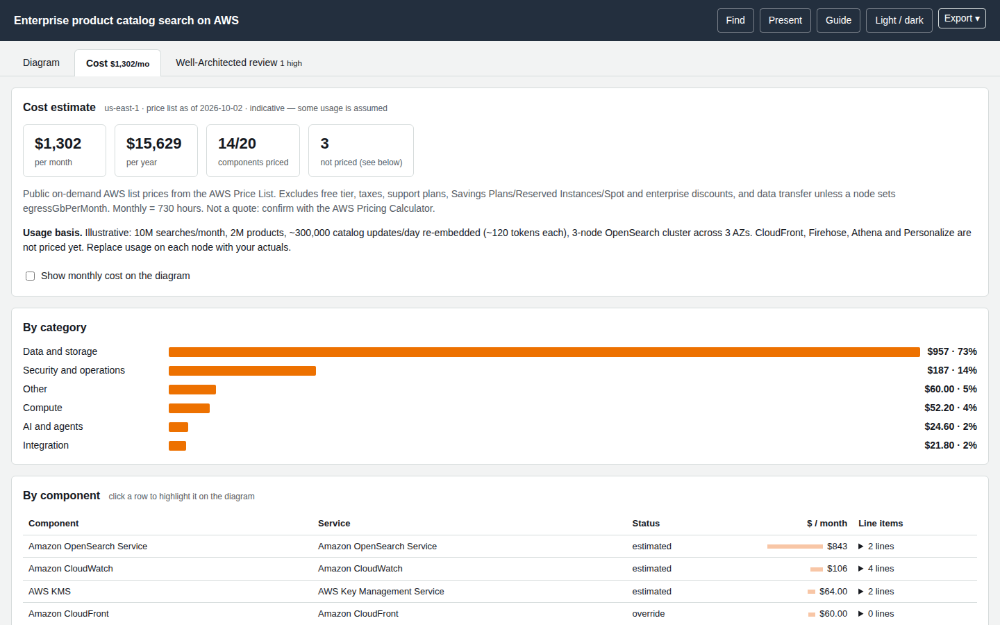

# Cost estimate

The **Cost** tab estimates monthly cost from the **public AWS Price List** (on-demand list prices). It is deterministic code, never a model's arithmetic, and every number can be traced to a rate, a quantity and an assumption.



## What the tab shows

* **Totals** per month and per year, how many components were priced, and how many were not.
* **By category** (compute, data and storage, AI and agents, …) and **by component**, with every line item expanded as `quantity × rate = cost` and the price-list SKU.
* **Assumptions** — every input is tagged **from spec** (you stated it) or **assumed** (a default). Any defaulted input makes the estimate **indicative**.
* **Sensitivity** at 1×, 3× and 10× traffic, and **what-ifs** (Lambda on arm64, RDS Multi-AZ cost, Bedrock batch inference, S3 Infrequent Access) where they apply.
* **Provenance**: the price-list publication date for each service and the retrieval date.
* A checkbox that overlays `$/mo` on the diagram.

## Giving it real numbers

Put a `usage` object on each node. Anything you leave out falls back to a documented default and is flagged as assumed.

```json
{ "id": "fm", "icon": "bedrock", "label": "Amazon Bedrock",
  "usage": { "model": "Claude Sonnet 5.5", "inputTokensPerMonth": 150000000, "outputTokensPerMonth": 15000000 } }
```

Describe the scenario once in `meta.cost.note` so readers know the basis:

```json
"meta": { "title": "…", "cost": { "region": "us-east-1", "note": "Illustrative: 200,000 questions/month, ~750 input and 75 output tokens each" } }
```

### Usage keys by service

| Service | Keys (default) |
|---|---|
| AWS Lambda | `requestsPerMonth` (1e6), `avgDurationMs` (200), `memoryMb` (512), `arch` (`x86` or `arm64`) |
| Amazon API Gateway | `type` (`rest` or `http`), `requestsPerMonth` (1e6) |
| Amazon DynamoDB | `readRequestsPerMonth` (5e6), `writeRequestsPerMonth` (1e6), `storageGb` (10) |
| Amazon S3 | `storageClass` (`standard`), `storageGb` (100), `putRequestsPerMonth` (1e5), `getRequestsPerMonth` (1e6) |
| Amazon SQS | `requestsPerMonth` (3e6), `fifo` (false) |
| Amazon SNS | `publishesPerMonth` (1e6) |
| AWS Step Functions | `stateTransitionsPerMonth` (1e6) |
| Amazon EventBridge | `eventsPerMonth` (1e6) |
| Amazon CloudWatch | `logIngestGbPerMonth` (10), `logStorageGb` (10), `customMetrics` (20), `alarms` (10) |
| AWS KMS | `keys` (1), `requestsPerMonth` (1e5) |
| AWS WAF | `webAcls` (1), `rules` (5), `requestsPerMonth` (1e6) |
| Amazon Cognito | `tier` (`essentials`), `mau` (1000) |
| AWS Secrets Manager | `secrets` (5), `apiCallsPerMonth` (1e5) |
| Amazon Textract | `feature` (`text`, `tables`, `forms`…), `pagesPerMonth` (10000) |
| Amazon Comprehend / Comprehend Medical | `feature` (`DetectEntities`), `unitsPerMonth` (1e6) |
| Amazon OpenSearch Service | `mode` (`provisioned` or `serverless`), `instanceType` (`r6g.large.search`), `instanceCount` (2), `storageGbPerNode` (100); serverless: `indexingOcu`, `searchOcu`, `storageGb` |
| AWS Fargate | `tasks` (2), `vcpu` (1), `memoryGb` (2), `hoursPerMonth` (730), `arch` |
| Amazon EC2 | `instanceType` (`m5.large`), `count` (2), `hoursPerMonth` (730), `ebsGbPerInstance` (50) |
| Amazon RDS | `instanceClass` (`db.r6g.large`), `engine` (`PostgreSQL`), `multiAz` (true), `storageGb` (100) |
| Amazon Aurora | `instanceClass`, `engine` (`Aurora PostgreSQL`), `instances` (2), `storageGb` (100) |
| Elastic Load Balancing | `type` (`application`), `avgLcu` (5) |
| NAT gateway | `count` (2), `gbProcessedPerMonth` (100) |
| Bedrock Guardrails | `textUnitsPerMonth` (2e5), `policies` (`["content","pii"]`, also `grounding`) |
| Amazon Bedrock (models) | **`model` is required** (for example `Claude Sonnet 5.5`, `Nova 2.0 Lite`, `Titan Embedding V2`), `mode` (`standard`, `batch`, `global`), `inputTokensPerMonth` (5e6), `outputTokensPerMonth` (1e6), `cacheReadTokensPerMonth` |
| Bedrock AgentCore | `component` (`runtime`, `gateway`, `memory`, `codeinterpreter`, `browser`, `evaluations`; detected from the label when omitted) plus per-component volumes such as `sessionsPerMonth`, `avgSessionMinutes`, `vcpu`, `memoryGb`, `cpuActiveFraction`, `invocationsPerMonth` |

Two keys work on **any** node:

* `usage.monthlyUsd` — supply the monthly cost yourself (status *override*). Use it for services without a cost model, and say where the number came from.
* `usage.egressGbPerMonth` — adds internet data-transfer-out.

## Honest statuses

| Status | Meaning |
|---|---|
| `estimated` | Priced from the price list with the stated and assumed inputs. |
| `override` | You supplied `usage.monthlyUsd`. |
| `no-charge` | The service has no direct charge (IAM Identity Center, Organizations, CloudFormation…). |
| `not-billable` | A general icon (users, internet), not an AWS resource. |
| `not-itemized` | AWS lists no separate price for it (some AgentCore components bill through CloudWatch or the runtime). |
| `needs-input` | A required input is missing (for example the Bedrock `model`). |
| `not-estimated` | No cost model for this service yet. Supply `usage.monthlyUsd` to include it. |
| `error` | The price book could not resolve an unambiguous rate; the reason is shown. |

The total only includes priced components, and the tab says how many were left out.

## What is and is not included

Included: public on-demand rates; 730 hours per month; binary storage units. **Excluded**: free tier, taxes, support plans, Savings Plans, Reserved Instances, Spot, enterprise discounts, credits, and data transfer unless you set `egressGbPerMonth`. Treat the result as a planning number and confirm it in the [AWS Pricing Calculator](https://calculator.aws/).

## From the command line

```bash
archify-aws cost spec.json                       # table in the terminal
archify-aws cost spec.json --scale 1,3,10        # sensitivity points
archify-aws cost spec.json --region us-east-1    # needs data/prices/<region>.json
archify-aws cost spec.json --usage usage.json    # {"<nodeId>": {…usage keys…}} overrides the spec's usage
archify-aws cost spec.json --json                # full machine-readable result
```

Turn the tab off with `render --no-cost` / `finalize --no-cost`.

The price snapshot is committed (`data/prices/us-east-1.json`, 26 services). Developers refresh it with `npm run prices:fetch`; see [Data refresh](../developer-guide/data-refresh.md).
