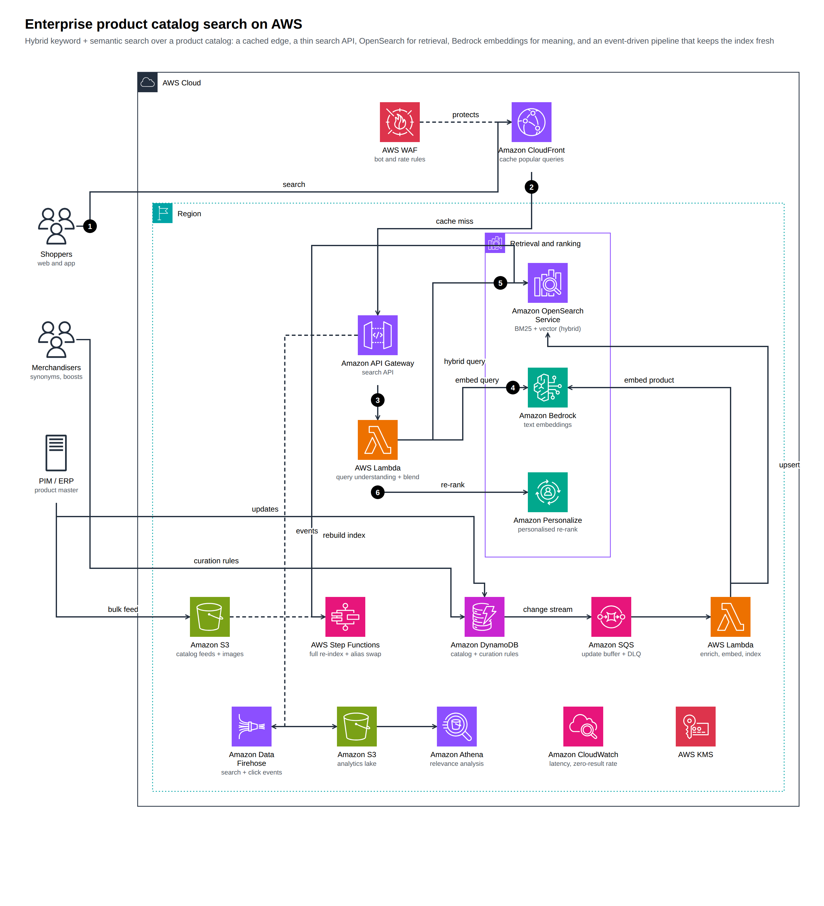

# Examples

Each example is a spec in the repository's `examples/` folder, rendered to a live page you can open (diagram, cost and review tabs, draw.io download). Specs carry **illustrative** usage; the cost note on each page says what was assumed. They are demonstrations, not quotes.

## Architecture

| Example | What it shows | Page | draw.io |
|---|---|---|---|
| Three-tier web app | Two AZs, ALB, Auto Scaling, RDS Multi-AZ, WAF and CloudFront | [open](../live/three-tier.html) | [file](../live/three-tier.drawio) |
| Serverless API | Cognito, API Gateway, Lambda, DynamoDB, SQS | [open](../live/serverless-api.html) | [file](../live/serverless-api.drawio) |
| RAG assistant on Bedrock | Guardrails, foundation model, vector store, invocation logging | [open](../live/genai-rag.html) | [file](../live/genai-rag.drawio) |
| **Product catalog search** | Hybrid keyword + vector search on OpenSearch, Bedrock embeddings, event-driven indexing, analytics | [open](../live/product-catalog-search.html) | [file](../live/product-catalog-search.drawio) |
| Healthcare agentic platform | Bedrock, AgentCore, HealthLake, governance and audit | [open](../live/healthcare-agentic-platform.html) | [file](../live/healthcare-agentic-platform.drawio) |
| AgentCore shared services | Many use cases on shared Runtime, Gateway, Memory, Policy, Identity and Observability | [open](../live/healthcare-agentcore-services.html) | [file](../live/healthcare-agentcore-services.drawio) |
| Multi-account governance | Organizations, Control Tower, Lake Formation, Macie, GuardDuty, Security Hub | [open](../live/healthcare-governance.html) | [file](../live/healthcare-governance.drawio) |
| Compliance review assistant (Step Functions) | 100 checks with human in the loop | [open](../live/compliance-architecture.html) | [file](../live/compliance-architecture.drawio) |
| Compliance review assistant (AgentCore) | Supervisor and check-family agents, Gateway + Policy, checkpoint-and-resume review | [open](../live/compliance-agentcore-architecture.html) | [file](../live/compliance-agentcore-architecture.drawio) |



## Sequence and dataflow

| Example | Type | Page |
|---|---|---|
| Agent tool call | sequence | [open](../live/agent-tool-call.html) |
| Compliance review run (Step Functions) | sequence | [open](../live/compliance-review-run.html) |
| Compliance review run (AgentCore) | sequence | [open](../live/compliance-agentcore-review-run.html) |
| Check-library lifecycle | dataflow | [open](../live/compliance-lifecycle.html) |
| Clinical notes pipeline | dataflow | [open](../live/clinical-notes.html) |

## Imported

| Example | Source | Page |
|---|---|---|
| Orders flow | Mermaid flowchart | [open](../live/mermaid-orders-flow.html) |
| Checkout | Mermaid sequence | [open](../live/mermaid-checkout.sequence.html) |
| Terraform stack | `examples/iac/terraform/` | [open](../live/iac-terraform.diagram.html) |
| SAM template | `examples/iac/sam/` | [open](../live/iac-sam.diagram.html) |

## Regenerate

```bash
npm run icons:fetch
node bin/archify-aws.mjs finalize examples/product-catalog-search.json
npm run examples          # re-renders every examples/*.json
```

The AgentCore variant has its own README comparing the two compliance designs (`examples/compliance-agentcore/README.md`).
