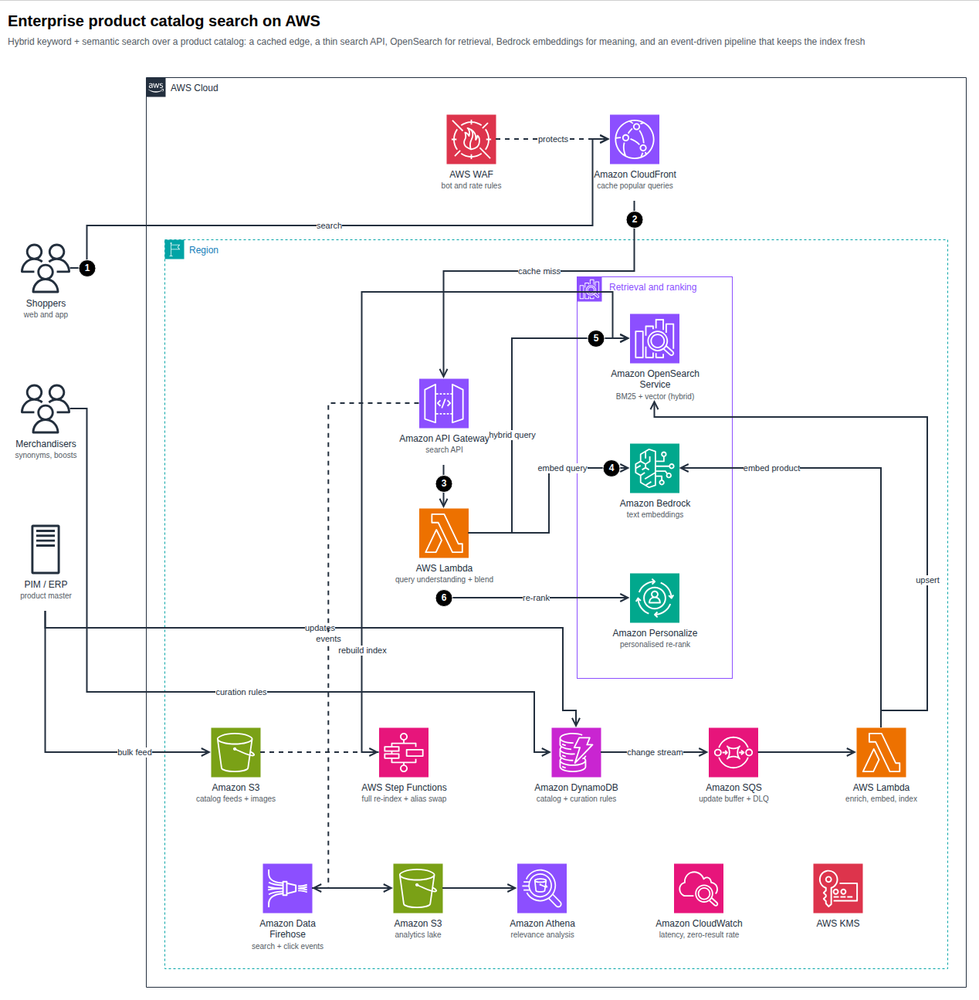

# Images, SVG and draw.io

| Format | How | Notes |
|---|---|---|
| **HTML page** | `render`, `finalize` | Standalone: no external requests. Diagram, Cost and Well-Architected tabs. |
| **SVG** | `render --svg`, `finalize`, or Export ▾ in the page | The page export is a **dual-theme SVG** (light, switching to dark when the viewer prefers it). Viewer state (focus, dimming, route, passport) is stripped. |
| **PNG** | `render --png`, `finalize`, or Export ▾ (also JPEG, WebP, copy to clipboard) | Needs Chrome/Chromium. |
| **draw.io** | `export`, `render --drawio`, `finalize`, or Export ▾ → *Download draw.io (.drawio)* | Uses draw.io's own AWS shapes. See below. |
| **JSON receipt** | `finalize` | Hashes and check results; see [Quality gates](finalize.md). |

<a id="drawio"></a>

## draw.io

```bash
archify-aws export spec.json -o diagram.drawio
archify-aws render spec.json --drawio
```

The file opens in [draw.io / diagrams.net](https://app.diagrams.net) (desktop, web, or the VS Code extension) and is fully editable.



What maps to what:

| archify-aws | draw.io |
|---|---|
| Service icon | `mxgraph.aws4.resourceIcon` with `resIcon=mxgraph.aws4.<service>` and the AWS category colour |
| Resource and general icons | `mxgraph.aws4.<shape>` |
| AWS Cloud, Region, VPC, subnets, account, Auto Scaling group… | `mxgraph.aws4.group` containers with `grIcon=group_*`; AZ, security group and generic groups use draw.io's plain dashed/solid containers |
| Nested groups | Real **containers**: move a group and its children follow |
| Edges | Attached to their icons, with the original waypoints and exit/entry points, open arrowheads, dashed style |
| Numbered callouts | Black numbered circles; the step description is the tooltip |
| Sequence diagram | Icons, dashed lifelines, message edges, `alt`/`loop`/`par` frames and notes |

!!! note "Notes on fidelity"
    * Layout is the archify-aws layout. draw.io may re-route an edge a little when you drag things.
    * An icon without a draw.io equivalent (a few AWS Elemental appliances) is embedded as the official SVG instead of failing; `export` tells you how many.
    * Edge labels are real edge labels (they follow the edge); callout circles are separate shapes.
    * The export is validated before it is written (unique ids, every reference resolves, every `mxgraph.aws4.*` name exists in draw.io's library).

## Presentation and documents

* Use `--theme dark` for slides and keep `light` for documents. Training and certification diagrams should use light.
* For a portrait page (Word, blogs) prefer `column` layouts at the root.
* PNG size follows the diagram; scale it in your document rather than re-flowing the spec.

## Icon licensing

Icons are © Amazon Web Services, Inc. or its affiliates. Use them to depict AWS architecture, do not alter them, and do not imply AWS endorsement. Rendered pages embed the icons they use; check the current AWS terms before publishing diagrams widely.
